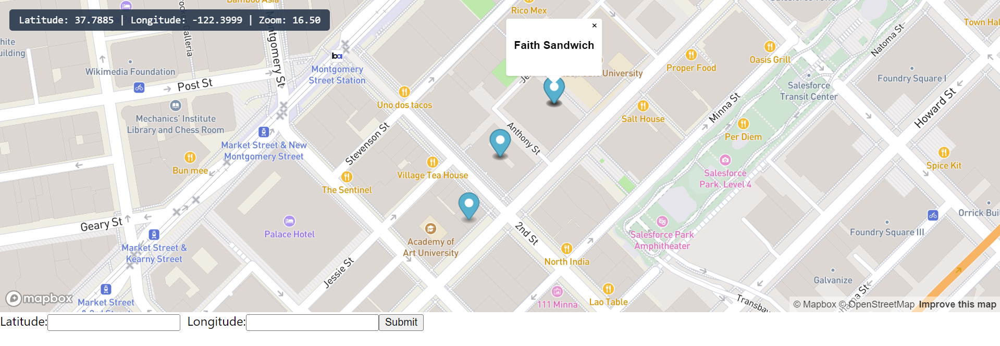

# FoodTruck-Discovery
 
This "Food Truck Discovery Web App," using React and Django, visually helps people find nearby food trucks in Palo Alto based on their location.



## Installation Instructions

1. Clone the repository
   
2. Navigate to the backend of the project
```
$ cd backend
```
3. Create and activate the virtual environment
```
$ python -m venv env

$ env\Scripts\activate
```
4. Download important packages
```
$ python -m pip install Django

$ python -m pip install django-cors-headers
```
5. Rename the .env.sample file in the "foodtruck-app" folder to .env and enter your mapbox access token in the quotation marks
   
6. Run the backend server
```
$ python manage.py migrate

$ python manage.py runserver
```
7. Navigate to the frontend of the project
  
8. Run the React App
```
$ npm install
$ npm start
```
